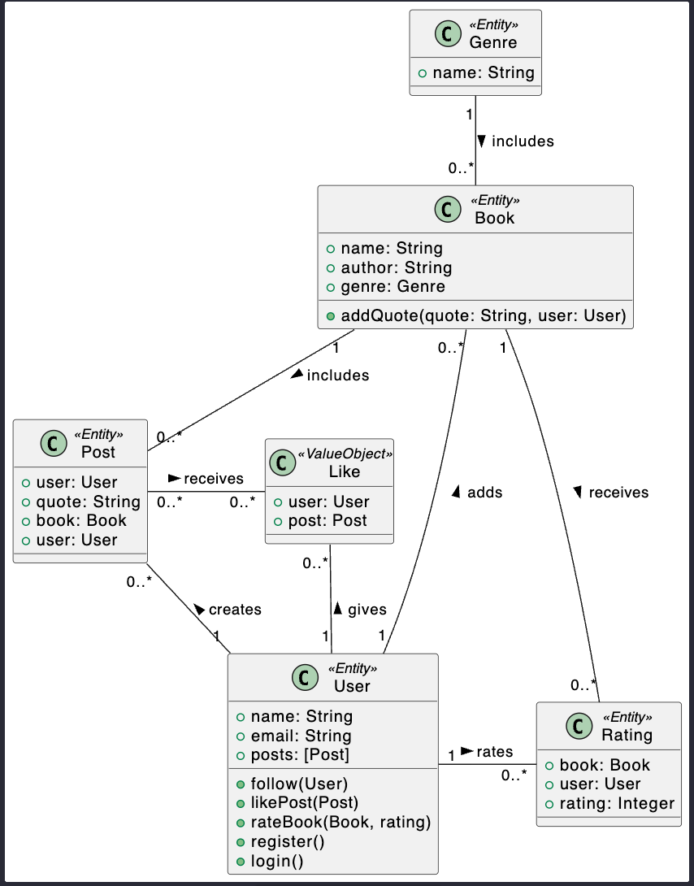
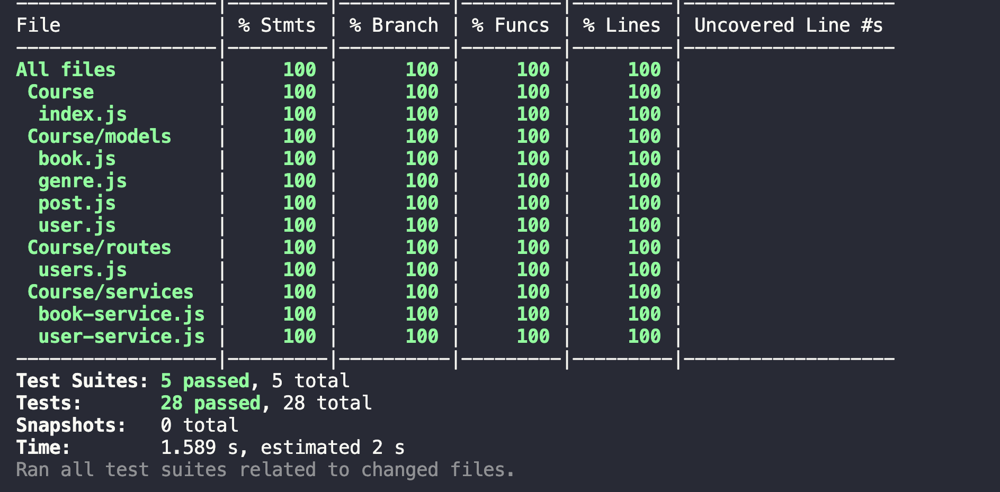

### Books Social Media
- Users can categorize the books they read based on their genres, enabling them to save summaries and favorite passages for each book. - Additionally, they can share these insights on their homepage. Readers have the option to follow other users, allowing them to discover and explore the sections of books that others found intriguing. 
- This way, users not only get to know people they are interested in but also enhance their reading experience by saving and revisiting memorable sections of books.
#### Used:
- Javascript
- Node.js
- MongoDB and Mongoose

#### You can try deployed app with the link:
```
https://frontend-v7l54nf5ga-ew.a.run.app/users/65e8b7fda334b5584cc8ef26
```
#### Uml Diagram using PUML


- API's created with **Express** 
- The template of the website was created dynamically with **Pug**(component based)
- **Axios** is used to make requests from frontend to backend
- **MongoDB** and **Mongoose** used to handle service operations

- To test, run
```
npm install supertest --save-dev
```

- These are tests:
